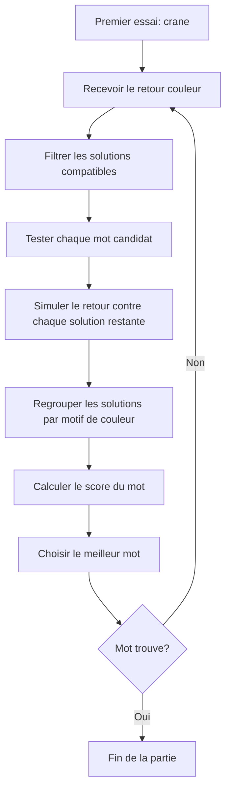
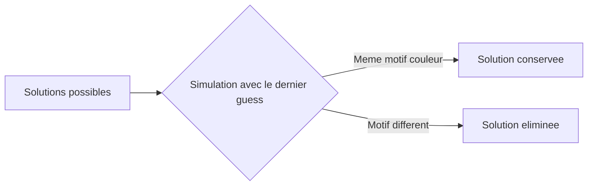
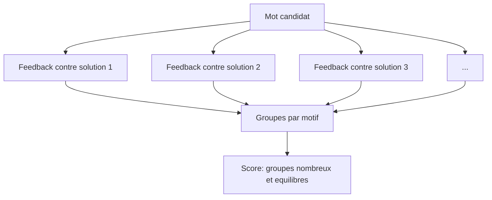

# Wordle

Un Wordle en terminal, construit avec Python et Rich, avec un solveur capable de
proposer les meilleurs mots a jouer. Le projet propose trois experiences :
jouer soi-meme, demander de l'aide pendant une partie, ou regarder l'IA resoudre
une grille automatiquement.

<p align="center">
  
</p>

## Installation

Le projet utilise Python 3.12+ et `uv` pour gerer l'environnement.

```bash
git clone git@github.com:Miglemus/Wordle.git
cd Wordle
uv sync
```

Si vous preferez cloner en HTTPS :

```bash
git clone https://github.com/Miglemus/Wordle.git
cd Wordle
uv sync
```

Lancer le mode par defaut :

```bash
uv run python main.py
```

Afficher l'aide du CLI :

```bash
uv run python main.py --help
```

## Utilisation

Le programme accepte deux options principales :

- `--game-mode`, ou `-g`, pour choisir l'experience.
- `--solver`, ou `-s`, pour choisir le solveur `normal` ou `fast`.

### Mode solver

Le solveur propose un mot. Vous jouez ce mot dans un Wordle externe, puis vous
entrez le retour couleur dans le terminal.

```bash
uv run python main.py --game-mode solver --solver normal
```

Raccourci equivalent :

```bash
uv run python main.py -g solver -s normal
```

Codes de retour :

- `v` ou `c` : vert / correct.
- `j` ou `p` : jaune / present.
- `g` ou `a` : gris / absent.

### Mode game

Vous jouez une partie locale de Wordle dans le terminal. Tapez `hint` pendant la
partie pour recevoir des suggestions du solveur.

```bash
uv run python main.py --game-mode game
```

### Mode game_solver

Le programme genere une solution aleatoire, puis l'IA joue toute seule jusqu'a
resoudre la grille.

```bash
uv run python main.py --game-mode game_solver
```

## Solveur rapide optionnel

Le solveur `fast` utilise une extension Cython/OpenMP pour accelerer le calcul
des scores. Le solveur `normal` reste disponible sans cette extension.

Sur Ubuntu/Debian, installez les dependances de compilation, puis reconstruisez
le package :

```bash
sudo apt install python3.12-dev build-essential
uv sync --reinstall-package wordle
```

Lancer le solveur rapide :

```bash
uv run python main.py --game-mode solver --solver fast
```

Limiter le nombre de threads OpenMP :

```bash
OMP_NUM_THREADS=8 uv run python main.py --game-mode solver --solver fast
```

## Comment l'algorithme fonctionne

Le solveur commence avec le mot `crane`. Apres chaque retour couleur, il reduit
la liste des solutions possibles, puis evalue tous les mots autorises pour
trouver celui qui separe le mieux les solutions restantes.



### Filtrage

Si le dernier essai etait `crane`, le solveur garde seulement les solutions qui
produiraient exactement le meme retour couleur.



### Scoring

Pour chaque mot jouable, le solveur simule ce mot contre toutes les solutions
restantes. Les solutions sont ensuite separees en groupes selon le motif obtenu
par Wordle.

Un bon mot est un mot qui :

- cree beaucoup de groupes differents;
- garde des groupes aussi equilibres que possible;
- est prefere s'il fait aussi partie des solutions possibles.

Dans le code, ce score est represente par :

```text
GuessScore(
  num_groups = nombre de motifs differents,
  std = ecart-type de la taille des groupes,
  is_possible_solution = le mot peut etre la solution
)
```

Le meilleur mot maximise `num_groups`, minimise `std`, puis favorise un mot qui
peut vraiment etre la solution.



Le solveur rapide applique la meme logique, mais encode les mots en entiers et
delegue le calcul massif des groupes a Cython/OpenMP.

## Vue d'ensemble des modes

| Mode | Commande | Ce que ca permet de faire |
| --- | --- | --- |
| `solver` | `uv run python main.py -g solver` | Utiliser l'IA comme assistant pour resoudre un Wordle externe. |
| `game` | `uv run python main.py -g game` | Jouer a Wordle dans le terminal, avec une aide optionnelle via `hint`. |
| `game_solver` | `uv run python main.py -g game_solver` | Regarder l'IA resoudre automatiquement une partie locale. |

## Structure rapide

```text
main.py                 # Point d'entree CLI
core/Game.py            # Logique d'une partie Wordle
core/Solver.py          # Solveur Python normal
core/FastSolver.py      # Solveur accelere Cython/OpenMP
core/Answer.py          # Evaluation des couleurs Wordle
core/Interface*.py      # Interfaces terminal des trois modes
solutions.txt           # Liste des solutions possibles
wordle-guesses.txt      # Liste des guesses acceptes
```
