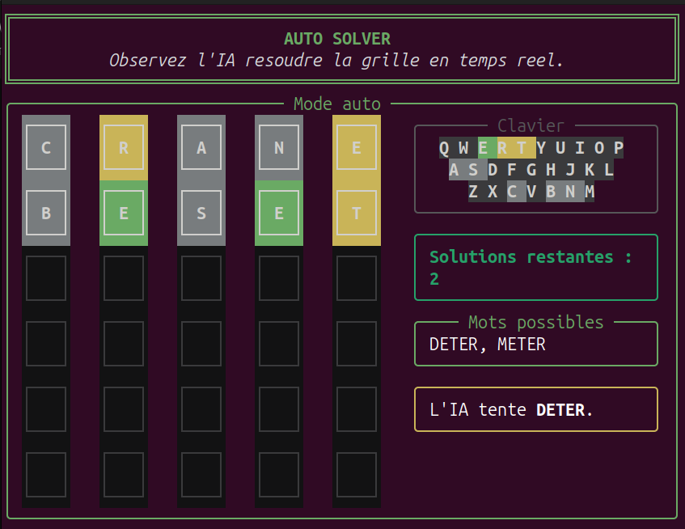
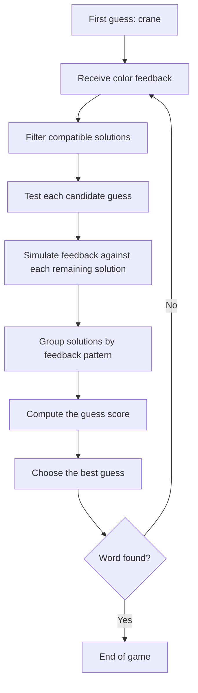
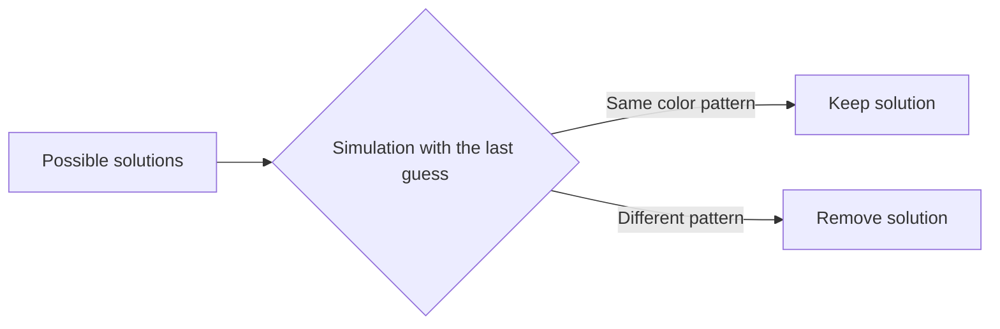
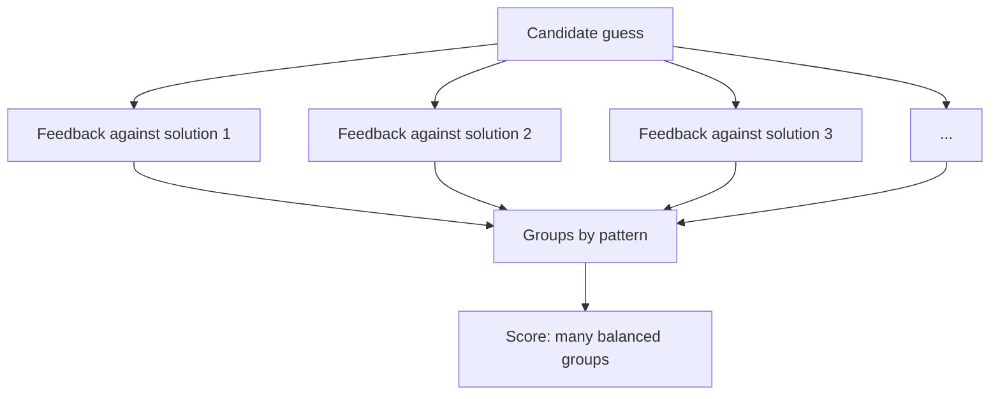

# Wordle

A terminal-based Wordle game built with Python and Rich, with a solver that can
suggest strong guesses. The project includes three experiences: play the game
yourself, ask for help during a game, or watch the AI solve a board
automatically.

<p align="center">
  
</p>

## Installation

This project uses Python 3.12+ and `uv` to manage the environment.

```bash
git clone git@github.com:Miglemus/Wordle.git
cd Wordle
uv sync
```

If you prefer cloning with HTTPS:

```bash
git clone https://github.com/Miglemus/Wordle.git
cd Wordle
uv sync
```

Run the default mode:

```bash
uv run python main.py
```

Show the CLI help:

```bash
uv run python main.py --help
```

## Usage

The program accepts two main options:

- `--game-mode`, or `-g`, to choose the experience.
- `--solver`, or `-s`, to choose the `normal` or `fast` solver.

### Solver mode

The solver suggests a word. You play that word in an external Wordle game, then
enter the color feedback in the terminal.

```bash
uv run python main.py --game-mode solver --solver normal
```

Equivalent shortcut:

```bash
uv run python main.py -g solver -s normal
```

Feedback codes:

- `v` or `c`: green / correct.
- `j` or `p`: yellow / present.
- `g` or `a`: gray / absent.

### Game mode

Play a local Wordle game directly in the terminal. Type `hint` during the game
to receive suggestions from the solver.

```bash
uv run python main.py --game-mode game
```

### Game solver mode

The program generates a random solution, then the AI plays by itself until it
solves the board.

```bash
uv run python main.py --game-mode game_solver
```

## Optional Fast Solver

The `fast` solver uses a Cython/OpenMP extension to speed up score computation.
The `normal` solver remains available without this extension.

On Ubuntu/Debian, install the build dependencies, then rebuild the package:

```bash
sudo apt install python3.12-dev build-essential
uv sync --reinstall-package wordle
```

Run the fast solver:

```bash
uv run python main.py --game-mode solver --solver fast
```

Limit the number of OpenMP threads:

```bash
OMP_NUM_THREADS=8 uv run python main.py --game-mode solver --solver fast
```

## How the Algorithm Works

The solver starts with the word `crane`. After each color feedback, it narrows
down the list of possible solutions, then evaluates every allowed guess to find
the word that best separates the remaining solutions.



### Filtering

If the last guess was `crane`, the solver keeps only the solutions that would
produce exactly the same color feedback.



### Scoring

For each playable word, the solver simulates that word against all remaining
solutions. The solutions are then split into groups based on the Wordle feedback
pattern they would produce.

A good guess is a word that:

- creates many different groups;
- keeps those groups as balanced as possible;
- is preferred if it is also one of the possible solutions.

In the code, this score is represented as:

```text
GuessScore(
  num_groups = number of different feedback patterns,
  std = standard deviation of group sizes,
  is_possible_solution = whether the guess can be the solution
)
```

The best word maximizes `num_groups`, minimizes `std`, then favors a word that
can actually be the solution.



The fast solver applies the same logic, but encodes words as integers and
delegates the heavy group computation to Cython/OpenMP.

## Mode Overview

| Mode | Command | What it does |
| --- | --- | --- |
| `solver` | `uv run python main.py -g solver` | Uses the AI as an assistant for solving an external Wordle. |
| `game` | `uv run python main.py -g game` | Lets you play Wordle in the terminal, with optional help through `hint`. |
| `game_solver` | `uv run python main.py -g game_solver` | Lets you watch the AI solve a local game automatically. |

## Quick Structure

```text
main.py                 # CLI entry point
core/Game.py            # Wordle game logic
core/Solver.py          # Normal Python solver
core/FastSolver.py      # Accelerated Cython/OpenMP solver
core/Answer.py          # Wordle color evaluation
core/Interface*.py      # Terminal interfaces for the three modes
solutions.txt           # Possible solution list
wordle-guesses.txt      # Accepted guess list
```
